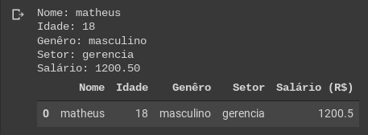

# Analisando Dados com Python - Pandas
</img>

Bibliotecas necessária:
- Pandas

Para instalar a biblioteca:
- pip install pandas ou pip3 install pandas

RECOMENDADO UTILIZAR ESSES ELEMENTOS NO: Jupyter, Google Colab ou Pycharm!
